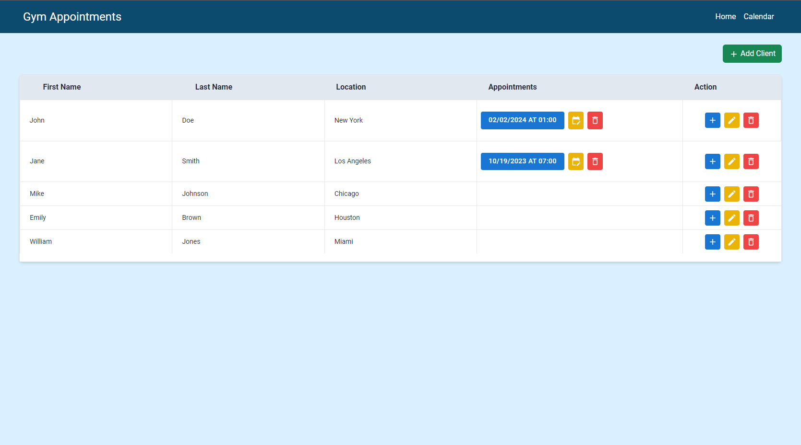
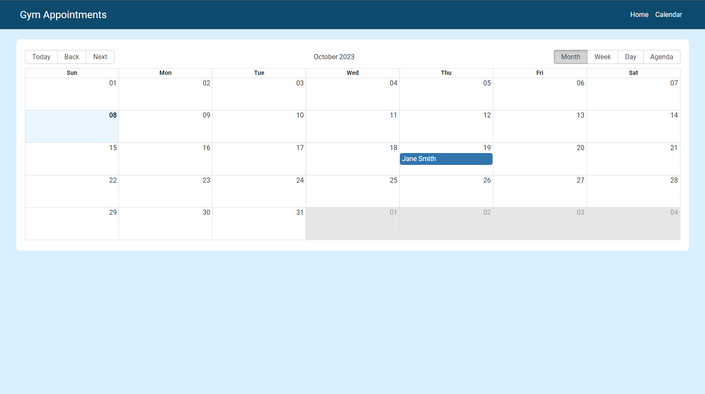
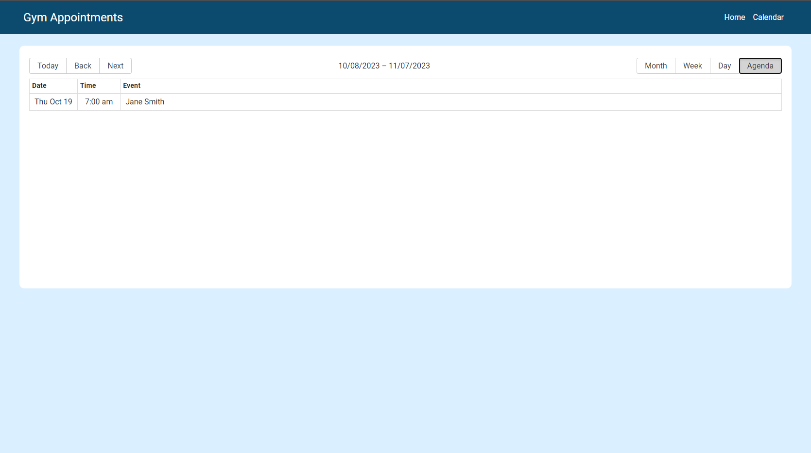

# Client Management Application

This is a front-end web application for managing client data and appointments. It provides a user-friendly interface to add, edit, and delete clients and their appointments. The application also features a calendar view for visualizing appointments. [https://gym-trainer-kappa.vercel.app/](https://gym-trainer-kappa.vercel.app/)

## Getting Started

### Installation

1. Clone the repository:

   ```bash
   git clone https://github.com/Anshum4n1/gym-trainer.git
   ```

2. Navigate to the project directory:

   ```bash
   cd gym-trainer
   ```

3. Install the project dependencies:

   ```bash
   npm install
   ```

### Running the Application

4. Start the development server:

   ```bash
   npm run dev
   ```

5. Open your web browser and visit `http://localhost:5173` to access the application.

## Images







## Usage

- **Dashboard**: The dashboard is the main interface for managing clients and appointments. You can add new clients, edit existing client information, and schedule appointments for clients.
- **Calendar**: The calendar page displays appointments in a visual calendar format. You can view appointments for different clients and dates.
- To add a client, click the "Add Client" button on the homepage.
- To schedule an appointment, use the "Add Appointment" button in the Action column in table.
- To make changes to an appointment, utilize the edit and delete buttons associated with a specific appointment.
- Appointments are in slots of one hour and duplicate slots are not allowed.
- To edit or delete the client, utilize the edit and delete buttons in the Action column in table.
- Access the Calendar section by clicking the "Calendar" link in the navigation bar.


## Features

- Add new clients with first name, last name, and location.
- Edit client details (first name, last name, location).
- Schedule appointments for clients with date and time.
- View appointments on a visual calendar.
- Delete appointments.
- Responsive design for different screen sizes.


---
Thank you for reviewing and getting acquainted with our application. Looking forward to hearing from you.
